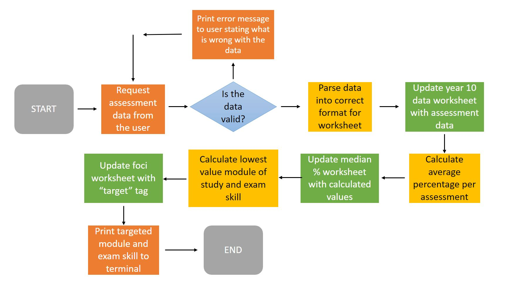
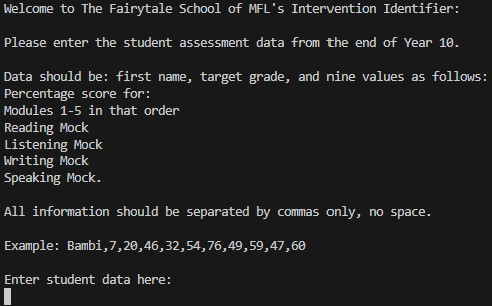
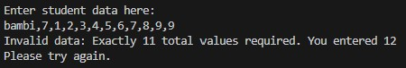
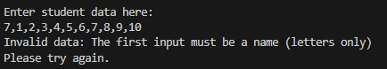
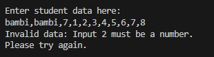
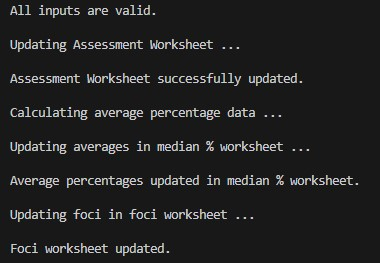
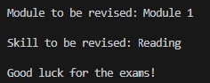

# The Fairytale School of MFL: Intervention Identifier

## Concept

The Fairytale School of MFL is monitoring its students' achievements in language-learning closely and want to target areas for development as their Year 10 pupils move into their final GCSE year of examinations.

They need a programme that can track student data based on their achievement in each module taught throughout the GCSE programme, combined with data from the mock GCSE examination results, and inform them of the modules of study that need to be revisited for further consolidation as well as specific examination skills where pupils need most practice.

This programme is designed for the user (teachers at the school) to input student data, calculate a median percentage of achievement per module and exam skill, update the worksheets with the recorded data, and identify the primary module and skill to target for intervention sessions.

Given the large amount of data teachers can acquire due to class sizes and quantity of assessments, this programme is designed to provide an instantaneous way for teachers to know where they need to target their focus when approaching exam study for their pupils, without the need for analysing streams of data manually.

This can be adapted to be used by class for individual teachers' personal approach based on their students' data, or by a Head of Department to assess the overall consensus based on a whole cohort of students' results, thereby meeting a variety of needs within a Modern Foreign Languages department.

## How to use the programme

As explained, the Intervention Identifier is designed to identify the specific areas of intervention required for a class of Year 10 pupils studying Modern Foreign Languages moving into their final year of GCSE examination studies.

When the programme loads, the user (a teacher), is asked to input the student data acquired at the end of the academic year.
This data needs to be in the format of: student name, target grade, module 1 data, module 2 data, module 3 data, module 4 data, module 5 data, reading mock data, listening mock data, writing mock data, speaking mock data.

Once the data is entered, the programme does the following:
* Inputs the data into the linked Google Sheet.
* Calculates the average percentage of all accumulated data by column.
* Updates the separate median data Google Sheet.
* Identifies the lowest value of data by both module and exam skill separately.
* Identifies the module and exam skill targeted by name.
* Updates the separate foci Google sheet.
* Prints to the terminal for the user to see: the module of study to be re-taught/revised, and the exam skill to be practiced.

## Logic Path Flow Chart

The programme needs to follow a specific path of logic in order to accurately read and calculate the data required by the user. For this, I have created the flow chart as seen below:

## Features

### Existing Features

* User data request

The terminal requests the user to input their student data, detailing required structure of input.

* Input validation and error checking

- The total number of values entered must be strictly equal to 11.

- The first value entered must strictly be a name (letters only).

- Inputs 2-11 must strictly be numeric.

* Data calculated and updated to spreadsheets, and communicated to the user in the terminal.

* Final output printed to terminal for user.

### Future Features

* Create function to identify individual students for intervention based on assessment data and tell user which module and exam skill to target for individual intervention.

* Develop for intervention focus based on unit of study within modules.

* Develop intervention focus for specific exam skill question/question style.

## Data Model

Due to the nature of my project handling data in Google Sheets, being inspired by Code Institue's "Love Sandwiches" project, I decided to use a Tabular Data Model to build my programme. In this context, the Google Sheet's structure is akin to a table, and the data model mirrors this tabular format. This model organizes data into rows and columns, making it straightforward to perform operations like indexing, slicing, and iterating over specific subsets of data.

The programme is made of functions that iterate across subsets of data in order to check, validate, and update data into tables. The model also features methods such as print methods to print out updates and information and return the results to the user.

### Bugs

#### Solved Bugs

* When writing the project, I initially ran across TypeErrors due to the required data from the user being a combination of strings and integers which were subsequently created as lists and then trying to perform operations on this data that strictly required only one type of data. I fixed these by using for loops and if statements to iterate across subsets of data and transform them into integers and/or strings based on a specific range of data.

* My try statement turning numeric data into integers intially failed due to my list containing a string and integers. Research lead me to identify the correct process to take to target only the numeric data.

* I had believed my update_assessment_data function was failing due my inadvertently inputing a space after every value when testing the programme. This was clearly human error only and in fact the programme was working fine. I therefore made the requirement for no spaces to be input explicit for the user in the intial print of required information.

* I ran across another TypeError when writing my find_lowest_values function as I was trying to call the index of a list of data that did not contain integers or slices. Iterating over it using a for loop helped solve the problem.

### Remaining Bugs

* No remaining bugs.

### Validator Testing

PEP8
* When run through Code Institute's recommended PEP8 online validator, my code threw many errors, primarily acertaining to line length exceeding the limit. I was able to correct this by removing unnecessary comments, shortening comments, and fragmenting lengthy code in accordance with Python's implicit line continuation.
* There were also many errors due to trailing white space. I fixed this by altering the settings to trim whitespace when saved which sped up the fixing process.
* There are now no errors thrown by the validator.

## Deployment

This project was deployed using Code Institute's mock terminal for Heroku.

Steps for deployment:
* Fork or clone this repository
* Create a new Heroku App
* Set the buildbacks to Python and NodeJS in that order
* Link the Heroku app to the repository
* Click on <strong>Deploy</strong>

## Credits

* Code Institue for the deployment terminal
* Code Institute's "Love Sandwiches" walkthrough for my initial inspiration with the project. I will state that I used this as the base for my project in setting up the APIs and beginning the code, which I then adapted to make it unique and meet the needs of my personal project. One will see the ways in which I have conducted my own research to adapt this and write it independently.
* https://stackoverflow.com/ for the forums where I sought answers in research, particularly surrounding turning lists of mixed data types into integers.
* https://www.geeksforgeeks.org/ for information on specific methods to Python coding researched.
* https://www.w3schools.com/ for information on specific methods to Python coding researched.